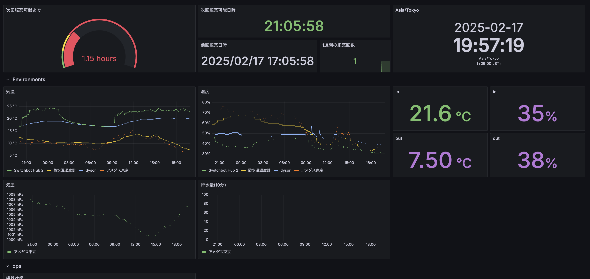
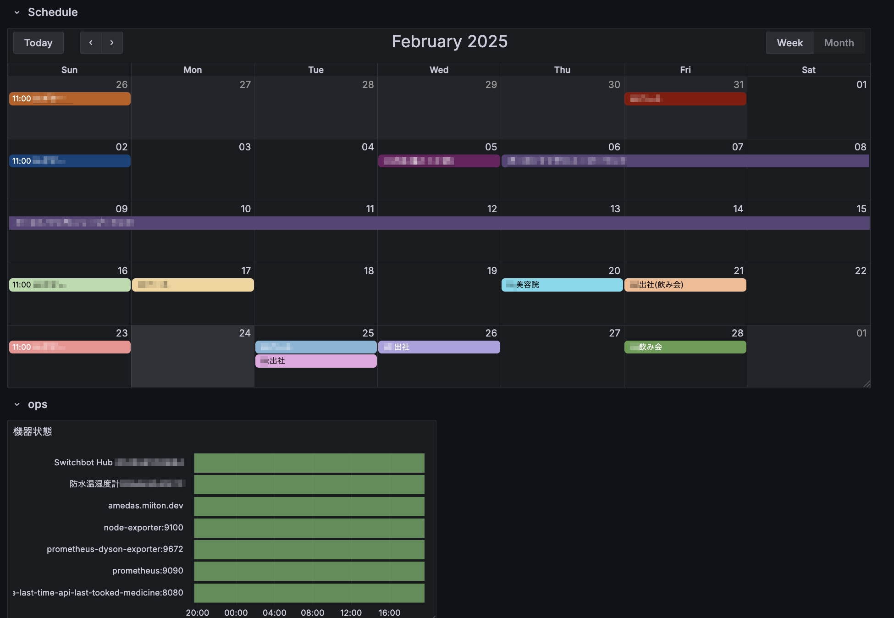

## env.

* Raspberry Pi OS ( Debian Bookworm 12 )
* aarch64

## setup
* https://docs.docker.com/engine/install/debian/

manual deploy
```
docker compose up -d
```

## features.

### Visualization
* 4時間空けなければいけない薬を服用したとき、amazon dash button によってそれを記録してメトリクス化し、Grafana上で「あと何時間で次の服用か」を表示する
    * nekmo/amazon-dash, grewhit25/amazon-dash
    * https://github.com/watahari/simpleLastTimeAPI
* switchbot-exporter による温湿度取得と、その表示
    * nasa9084/switchbot-exporter
* prometheus-dyson-exporter による温湿度取得と、その表示
    * zkhcohen/prometheus-dyson-exporter
* amedas\_exporter による観測情報の表示
    * データの出典: amedas\_exporter （ https://amedas.miiton.dev/ ）
* GCalJSON と Grafana Business Calendar を利用した家庭内スケジュールの表示
    * https://github.com/watahari/GCalJSON
    * https://grafana.com/grafana/plugins/marcusolsson-calendar-panel/




### Smart home

* Homebridge
    * 設定等は秘密情報を含むため別管理している

## ops.
* 系の監視のページングはDiscordに対して行なう

## architecture

app.

* Prometheus
* AlertManager
* Grafana
* some exporters & api
* Homebridge

container

* docker

H/W

* Raspberry Pi
