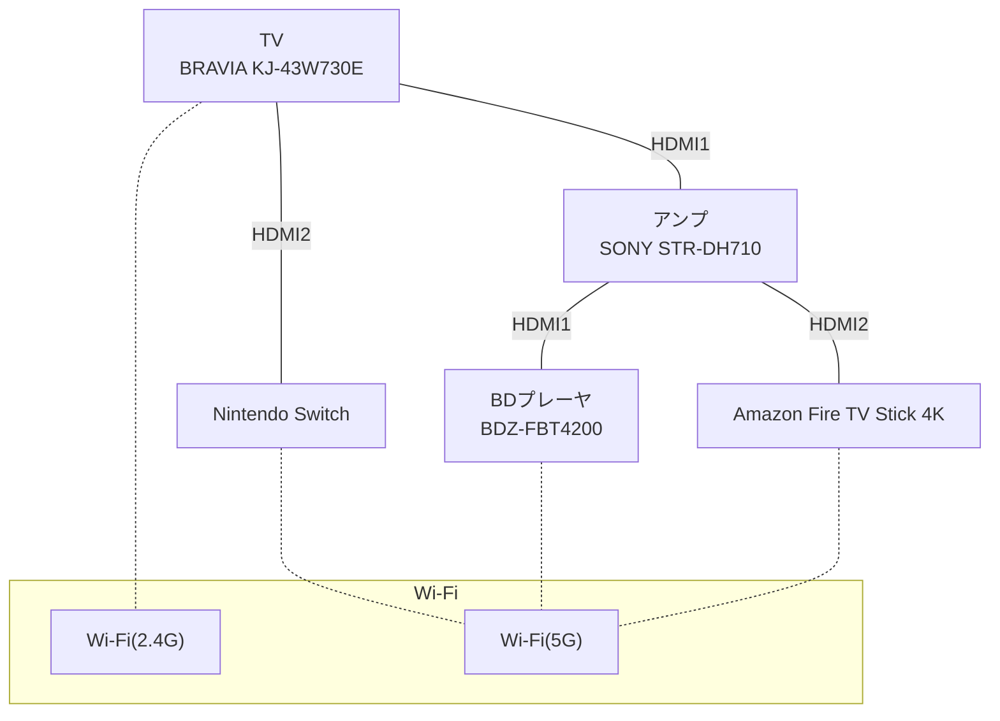
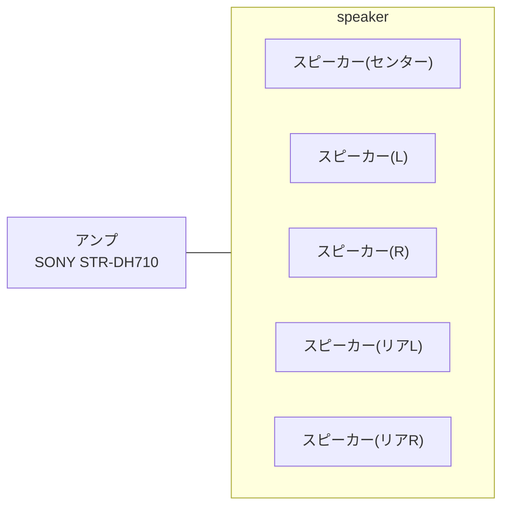

# Audio Visual System

## HDMI

## Audio

## Nintendo Switch item list

* Joy-Con(R) ネオンレッド
* Joy-Con(L) ネオンブルー
* Joy-Con(R) ネオンオレンジ
* Joy-Con(L) ネオンパープル
* Nintendo Switch Proコントローラー
* リングコン
* フィットボクシング用グリップ * 2
* カラオケ用マイク
