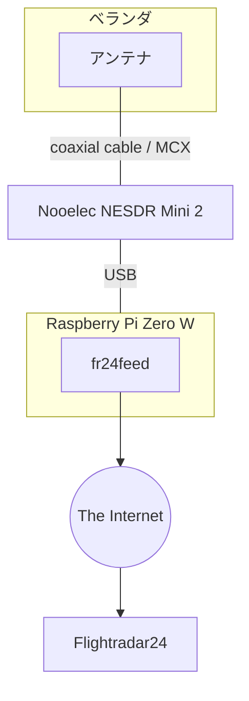

# Flightradar feeder

```mermaid
flowchart TB
    subgraph ベランダ
        anntena["アンテナ"]
    end
    anntena --coaxial cable / MCX--- receiver["Nooelec NESDR Mini 2"]
    receiver --USB--- pizero
    subgraph pizero["Raspberry Pi Zero W"]
        fr24feed
    end
    fr24feed --> internet
    internet(("The Internet")) --> fr24["Flightradar24"]
```