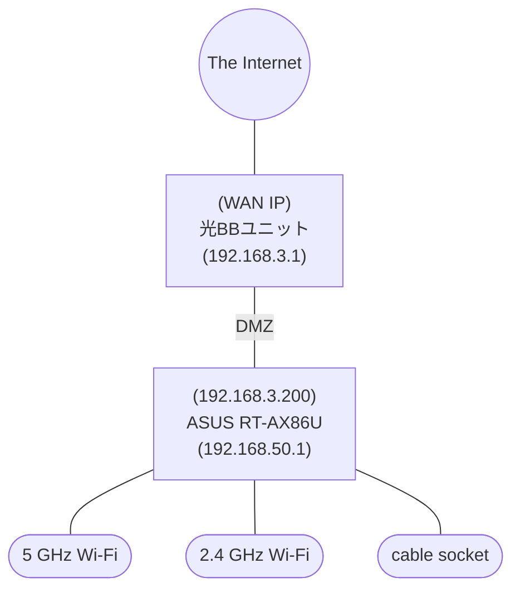

# Network

## Network Diagram

## Devices with Static DHCP allocation

name             | static IP      | Reason
-----------------|----------------|---------
RaspberryPi 5    | 192.168.50.207 | Homebridge server
Dyson PH04       | 192.168.50.192 | Homebridge client
Roomba Combo j9+ | 192.168.50.206 | Homebridge client
RaspberryPi zero | 192.168.50.190 | No (Old Homebridge server)

## Wi-Fi connected devices

Below are devices connected to 2.4 GHz Wi-Fi

* Raspberry Pi zero
* Switchbot Hub 2
* Tapo Camera C100
* Sony TV BRAVIA KJ-43W730E
* Smartlife Tap

All other devices are connected to 5 GHz Wi-Fi.

## Physical ethernet cable connected devices

* Phlips Hue Hub
