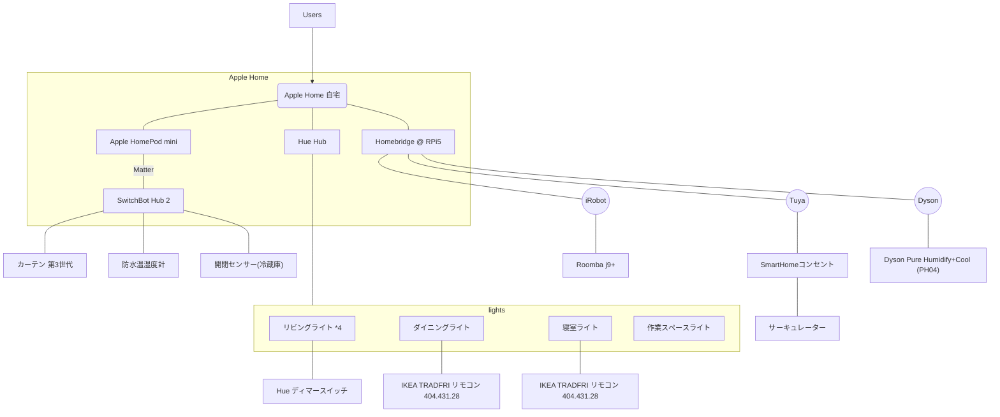
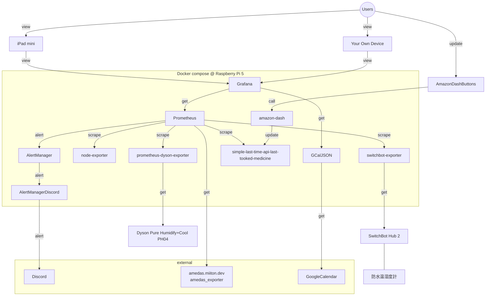

# Smart Home System

## Control

```mermaid
graph TB
    Users ---> home

    subgraph Apple Home
        direction TB
        home("Apple Home 自宅")
        home --- homepod["Apple HomePod mini"]
        switchbothub["SwitchBot Hub 2"]

        home --- huehub["Hue Hub"]
        home --- pi5hb["Homebridge @ RPi5"]

        homepod-- Matter ---switchbothub
    end

    pi5hb --- irobot(("iRobot")) --- roomba["Roomba j9+"]
    pi5hb --- tuya(("Tuya")) --- sh_uoutlet["SmartHomeコンセント"] --- fan["サーキュレーター"]
    pi5hb --- dyson(("Dyson")) --- dysonHP["Dyson Pure Humidify+Cool (PH04)"]

    switchbothub --- curtain["カーテン 第3世代"]
    switchbothub --- sensor_out["防水温湿度計"]
    switchbothub --- sensor_door["開閉センサー(冷蔵庫)"]

    subgraph lights
        direction TB
        lights_living["リビングライト *4"]
        lights_dining["ダイニングライト"]
        lights_bedroom["寝室ライト"]
        lights_officeroom["作業スペースライト"]
    end
    huehub ----- lights

    lights_living --- hue_sw["Hue ディマースイッチ"]
    lights_dining --- ikea_sw1["IKEA TRADFRI リモコン 404.431.28"]
    lights_bedroom --- ikea_sw2["IKEA TRADFRI リモコン 404.431.28"]
```

## Visualization

```mermaid
graph TB
    Users((Users)) --view--> iPad["iPad mini"]
    Users --view--> yod["Your Own Device"]

    iPad & yod --view--> Grafana

    Users --update--> AmazonDashButtons --call--> amazon-dash

    subgraph "Docker compose @ Raspberry Pi 5"
        direction TB
        Grafana --get--> Prometheus
        Prometheus --alert--> AlertManager --alert--> AlertManagerDiscord

        Prometheus --scrape--> node-exporter
        Prometheus --scrape--> switchbot-exporter
        Prometheus --scrape--> prometheus-dyson-exporter
        Prometheus --scrape--> simple-last-time-api-last-tooked-medicine

        amazon-dash --update--> simple-last-time-api-last-tooked-medicine

        Grafana --get--> GCalJSON
    end

    switchbot-exporter --get---> switchbothub["SwitchBot Hub 2"]
    switchbothub --- sensor_out["防水温湿度計"]

    prometheus-dyson-exporter --get---> dysonHP["Dyson Pure Humidify+Cool PH04"]

    subgraph external
        AlertManagerDiscord --alert---> Discord
        Prometheus --get----> amedas_exporter["amedas.miiton.dev<br>amedas_exporter"]
        GCalJSON --get----> GoogleCalendar
    end
```