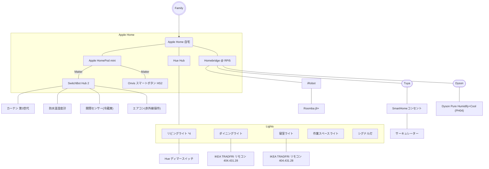
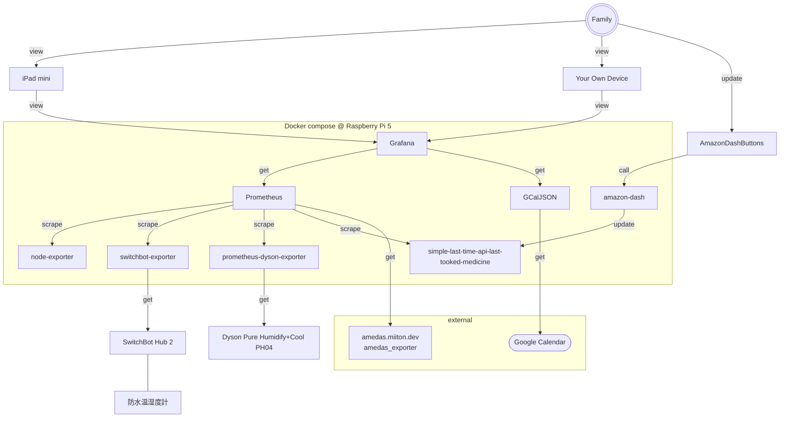
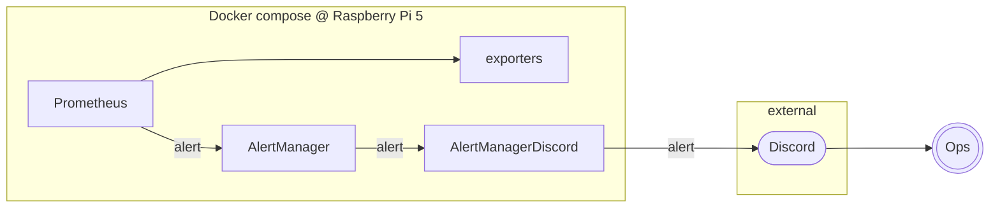
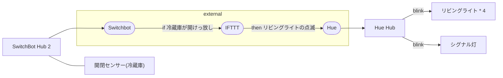

# Smart Home System

## Control

```mermaid
graph TB
    Family(((Family))) ---> Home

    subgraph Apple Home
        direction TB
        Home("Apple Home 自宅")
        Home --- Homepod["Apple HomePod mini"]
        Switchbothub["SwitchBot Hub 2"]

        Home --- HueHub["Hue Hub"]
        Home --- Pi5HB["Homebridge @ RPi5"]

        Homepod-- Matter ---Switchbothub

        Homepod-- Matter ---OnvisSW["Onvis スマートボタン HS2"]
    end

    Pi5HB --- iRobot --- Roomba["Roomba j9+"]
    Pi5HB --- Tuya(["Tuya"]) --- SHOutlet["SmartHomeコンセント"] --- fan["サーキュレーター"]
    Pi5HB --- Dyson(["Dyson"]) --- DysonHP["Dyson Pure Humidify+Cool (PH04)"]

    Switchbothub --- SWCurtain["カーテン 第3世代"]
    Switchbothub --- SWSensorOut["防水温湿度計"]
    Switchbothub --- SWSensorDoor["開閉センサー(冷蔵庫)"]
    Switchbothub --- SWIRAircon["エアコン(赤外線操作)"]

    subgraph Lights
        direction TB
        LightsLiving["リビングライト *4"]
        LightsDining["ダイニングライト"]
        LightsBedroom["寝室ライト"]
        LightsOfficeRoom["作業スペースライト"]
        LightsSignal["シグナル灯"]
    end
    HueHub ----- Lights

    LightsLiving --- HueSw["Hue ディマースイッチ"]
    LightsDining --- IkeaSw1["IKEA TRADFRI リモコン 404.431.28"]
    LightsBedroom --- IkeaSw2["IKEA TRADFRI リモコン 404.431.28"]
```

## Visualization

```mermaid
graph TB
    Family(((Family))) --view--> iPad["iPad mini"]
    Family --view--> YOD["Your Own Device"]

    iPad & YOD --view--> Grafana

    Family --update--> AmazonDashButtons --call--> AmazonDash["amazon-dash"]

    subgraph "Docker compose @ Raspberry Pi 5"
        direction TB
        Grafana --get--> Prometheus

        Prometheus --scrape--> NodeExporter["node-exporter"]
        Prometheus --scrape--> SwitchbotExporter["switchbot-exporter"]
        Prometheus --scrape--> PrometheusDysonExporter["prometheus-dyson-exporter"]
        Prometheus --scrape--> SimpleLastTimeApiLastTookedMedicine["simple-last-time-api-last-tooked-medicine"]

        AmazonDash --update--> SimpleLastTimeApiLastTookedMedicine

        Grafana --get--> GCalJSON
    end

    SwitchbotExporter --get--> Switchbothub["SwitchBot Hub 2"]
    Switchbothub --- SWSensorOut["防水温湿度計"]

    PrometheusDysonExporter --get--> DysonHP["Dyson Pure Humidify+Cool PH04"]

    subgraph external
        Prometheus --get---> AmedasExporter["amedas.miiton.dev<br>amedas_exporter"]
        GCalJSON --get---> GoogleCalendar([Google Calendar])
    end
```

## Monitoring

### Visualization system

```mermaid
graph LR
    subgraph "Docker compose @ Raspberry Pi 5"
        Prometheus ---> Targets["exporters"]
        Prometheus --alert--> AlertManager --alert--> AlertManagerDiscord
    end

    subgraph external
        AlertManagerDiscord --alert---> Discord
    end

    Discord([Discord]) ---> Ops(((Ops)))
```

### Monitoring refrigerators left open

```mermaid
graph LR
    Switchbothub["SwitchBot Hub 2"]
    Switchbothub --- SWSensorDoor["開閉センサー(冷蔵庫)"]
    Switchbothub --> SWSwitchbotService
    subgraph external
        SWSwitchbotService([Switchbot]) --if 冷蔵庫が開けっ放し--> IFTTT([IFTTT])
        IFTTT --then リビングライトの点滅--> Hue([Hue])
    end
    Hue --> HueHub["Hue Hub"]
    HueHub --blink--> LightsLiving["リビングライト * 4"]
    HueHub --blink--> LightsSignal["シグナル灯"]
```